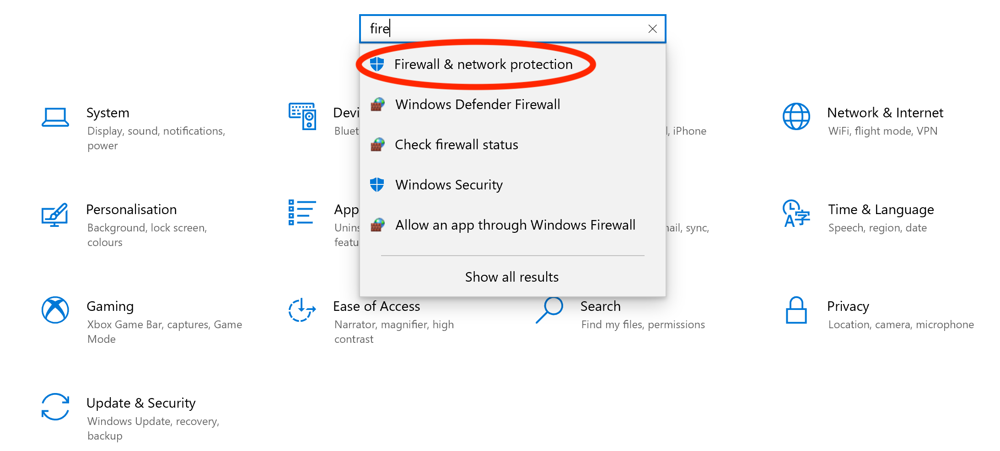
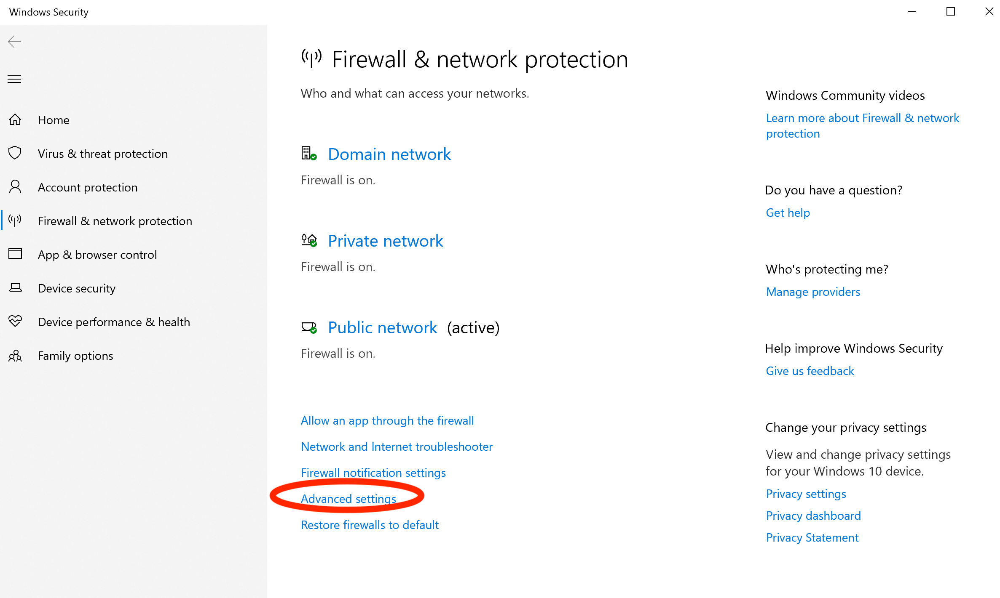
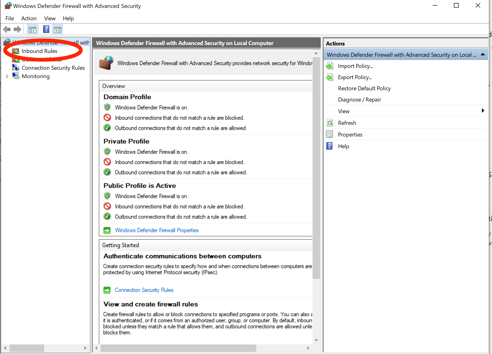
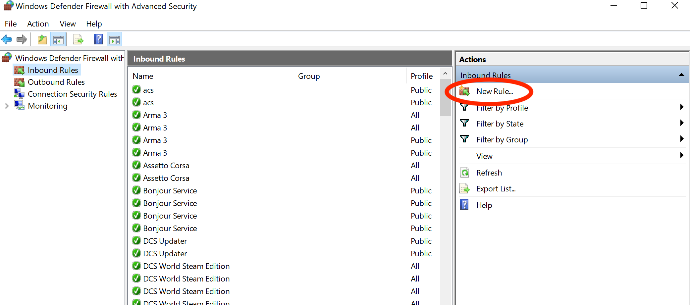
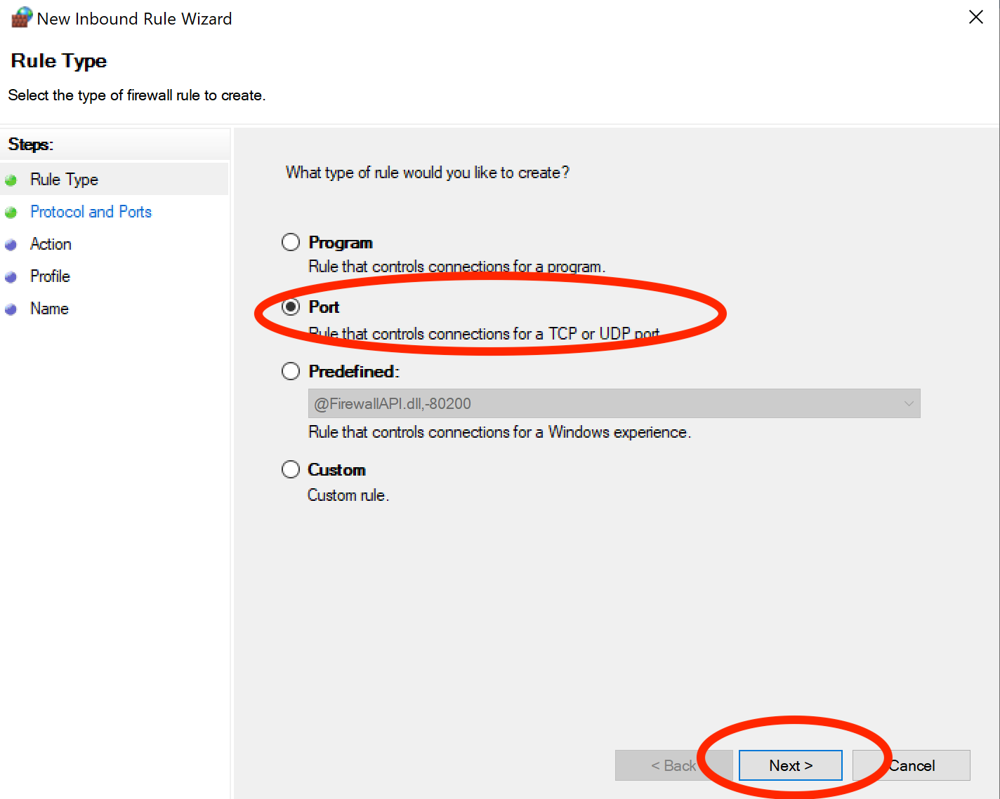
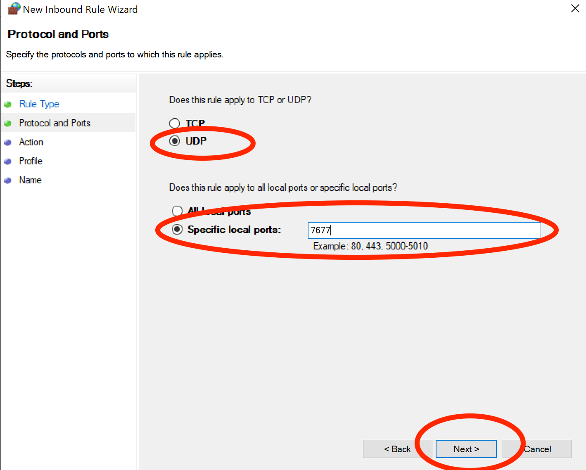
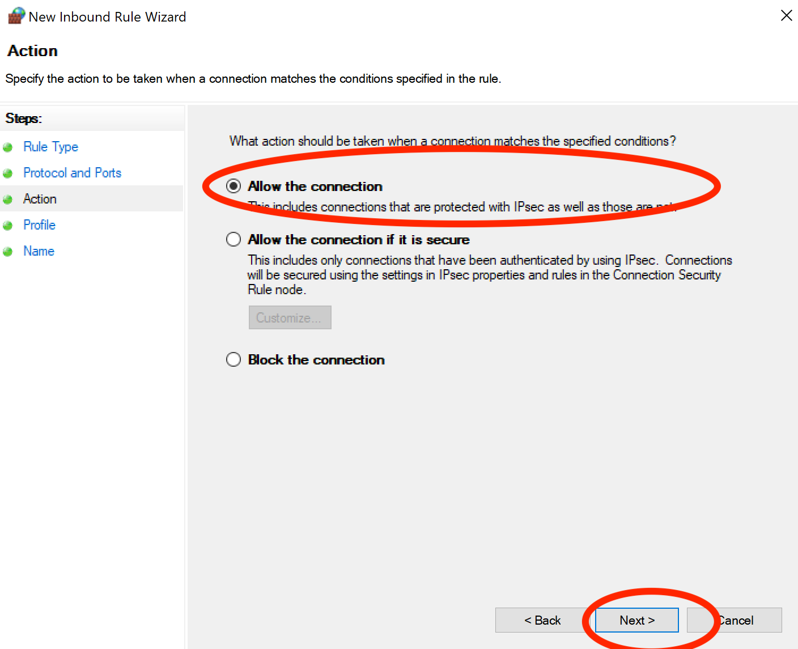
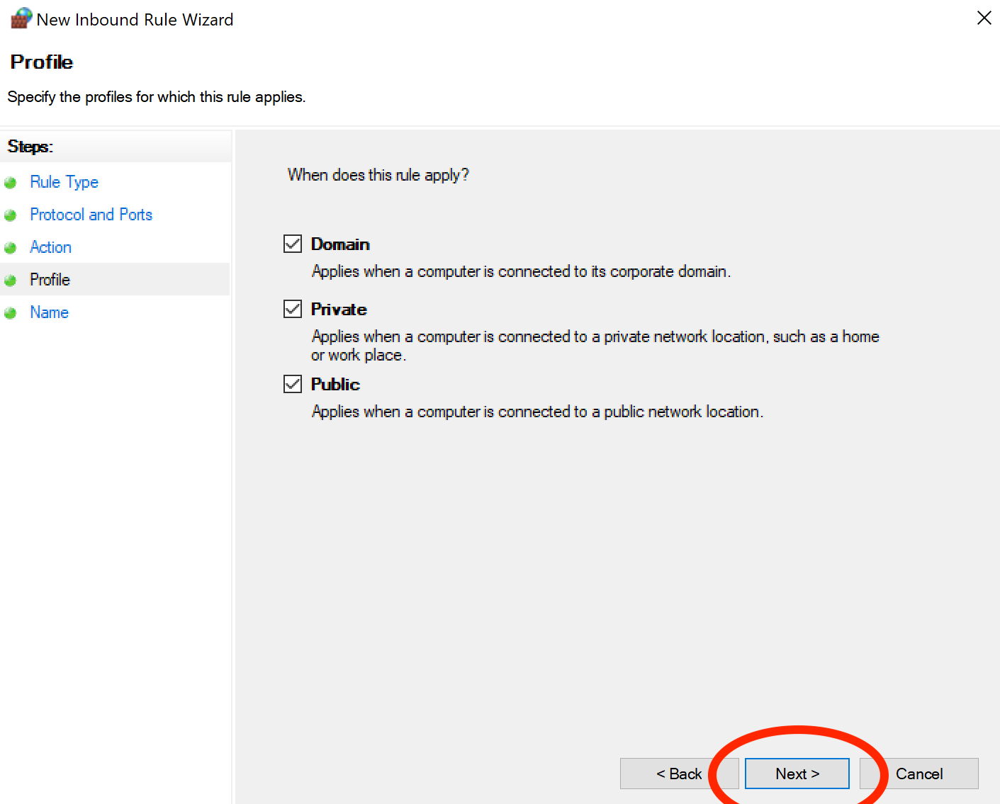
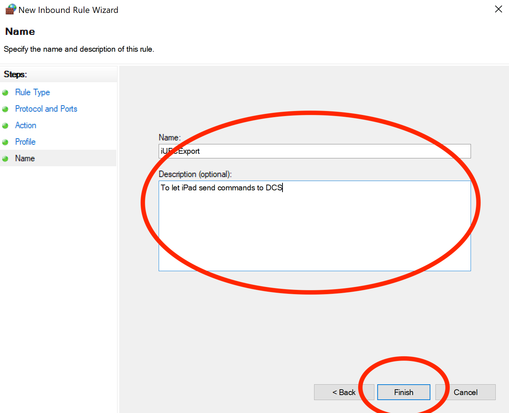

### Step 1: Open "Firewall and network protection" settings
You can find it in your Windows settings.

### Step 2: Click on "Advanced settings"

This will open the application: "Windows Defender Firewall with Advanced Security"

### Step 3: Select "Inbound rules"

### Step 4: Click on "New Rule..."

This will open an inbound rule creation wizard.

### Step 5: Select type of rule "Port"

Then click "Next"

### Step 6: Select protocol and ports
For the protocol, choose "UDP".
For the ports, select "Specific local ports" and enter value 7677.

Then click "Next"

### Step 7: Select action: "Allow the connection"

Then click "Next"

### Step 8: Leave profile selection by default

Then click "Next"

### Step 9: Give the rule a name and description
You can enter the suggested texts below or just use the texts you'd like.

That's it!